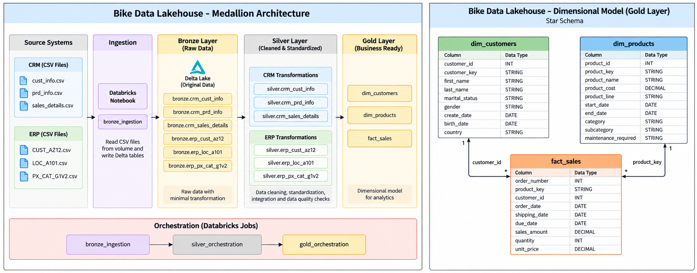

# 🚲 Bike Data Lakehouse

An end-to-end **batch Data Lakehouse pipeline** built using **Databricks and PySpark**, implementing a **Bronze → Silver → Gold Medallion Architecture**.

The pipeline ingests CRM and ERP source data, performs data cleansing and cross-system integration, builds an analytics-ready dimensional model, and orchestrates the complete workflow using **Databricks Jobs**.



---

## 🏗️ Architecture

```text
CRM / ERP CSV Sources
        ↓
Bronze Layer
Raw Delta Tables
        ↓
Silver Layer
Cleaned & Integrated Data
        ↓
Gold Layer
Dimensional Model
        ↓
Databricks Job
End-to-End Orchestration
```

### Pipeline Flow

```text
bronze_ingestion
       ↓
silver_orchestration
       ↓
gold_orchestration
```

---

## 🥉 Bronze Layer

The Bronze layer ingests the raw CRM and ERP CSV source files into Delta tables with minimal transformation.

### CRM Sources

- `crm_cust_info`
- `crm_prd_info`
- `crm_sales_details`

### ERP Sources

- `erp_cust_az12`
- `erp_loc_a101`
- `erp_px_cat_g1v2`

---

## 🥈 Silver Layer

The Silver layer cleans, standardizes, validates, and integrates the Bronze data.

### CRM Transformations

- Customer cleansing and deduplication
- Product attribute standardization
- Sales date conversion and validation
- Business-key validation
- Customer referential-integrity validation
- Product referential-integrity validation
- Cross-system product-key reconciliation

### ERP Transformations

- Customer gender standardization
- Invalid/future birth-date handling
- Country normalization
- Product-category standardization
- Business-key validation

CRM and ERP identifiers were normalized where the source systems used different identifier formats, allowing the datasets to be integrated reliably.

---

## 🥇 Gold Layer

The Gold layer provides analytics-ready dimensional tables.

### `dim_customers`

A customer dimension combining CRM customer information with ERP birth-date and location attributes.

### `dim_products`

A product dimension combining CRM product information with ERP category and maintenance metadata.

Historical product versions are retained rather than deduplicating solely by product key.

### `fact_sales`

A sales transaction fact table with the grain:

```text
order_number + product_key
```

It contains order, product, customer, date, quantity, price, and sales information.

### Final Gold Tables

| Table | Rows |
|---|---:|
| `dim_customers` | 18,484 |
| `dim_products` | 397 |
| `fact_sales` | 60,398 |

---

## 🔄 Orchestration

### Silver Orchestration

The Silver parent notebook executes six transformation notebooks:

```text
silver_orchestration
│
├── silver_crm_cust_info
├── silver_crm_prd_info
├── silver_crm_sales_details
├── silver_erp_cust_az12
├── silver_erp_loc_a101
└── silver_erp_px_cat_g1v2
```

### Gold Orchestration

The Gold parent notebook executes three Gold transformation notebooks:

```text
gold_orchestration
│
├── dim_customers
├── dim_products
└── fact_sales
```

### Databricks Job

The complete batch pipeline is orchestrated through a Databricks Job:

```text
bronze_ingestion
       ↓
silver_orchestration
       ↓
gold_orchestration
```

The complete Bronze → Silver → Gold workflow has been successfully executed end-to-end.

---

## 🔍 Data Quality

Data-quality validation was performed throughout the pipeline, including:

- NULL-value checks
- Duplicate detection
- Business-key uniqueness
- Date validity
- Date relationship validation
- Referential integrity
- Cross-system identifier matching
- Product-key reconciliation
- Row-count validation
- Post-transformation sanity checks

### Verified Relationships

- Sales → CRM Customers: **0 unmatched**
- Sales → CRM Products: **0 unmatched**
- CRM Customers → ERP Customers: **0 unmatched**
- CRM Customers → ERP Locations: **0 unmatched**

---

## 🛠️ Technology Stack

- **Databricks**
- **PySpark**
- **Python**
- **Delta Lake**
- **Unity Catalog**
- **Databricks Jobs**
- **Git / GitHub**
- **Draw.io**

---

## 📁 Repository Structure

```text
bike-data-lakehouse/
│
├── README.md
│
├── docs/
│   └── architecture/
│       └── lakehouse_architecture.png
│
├── bronze/
│   └── bronze_ingestion.ipynb
│
├── silver/
│   ├── silver_orchestration.ipynb
│   │
│   ├── crm/
│   │   ├── silver_crm_cust_info.ipynb
│   │   ├── silver_crm_prd_info.ipynb
│   │   └── silver_crm_sales_details.ipynb
│   │
│   └── erp/
│       ├── silver_erp_cust_az12.ipynb
│       ├── silver_erp_loc_a101.ipynb
│       └── silver_erp_px_cat_g1v2.ipynb
│
└── gold/
    ├── gold_orchestration.ipynb
    ├── dim_customers.ipynb
    ├── dim_products.ipynb
    └── fact_sales.ipynb
```

---

## 📚 Credits

This project was developed as a hands-on Data Engineering implementation based on the **Data Engineering concepts, educational material, and project guidance provided by Baraa Khatib Salkini (DataWithBaraa)**.

Special thanks to **Baraa Khatib Salkini / DataWithBaraa** for the learning resources and project inspiration.

- **DataWithBaraa:** [GitHub](https://github.com/DataWithBaraa)
- **DataWithBaraa:** [YouTube](https://www.youtube.com/@DataWithBaraa)

---

## 👨‍💻 Author

### Adaka Sivanagaraju

**Data Engineering | SQL | Python | PySpark | Databricks | Delta Lake**

- 🐙 GitHub: [SivaNR373](https://github.com/SivaNR373)
- 💼 LinkedIn: [sivan373](https://www.linkedin.com/in/sivan373/)
- 📧 Email: [sivanagaraju373@gmail.com](mailto:sivanagaraju373@gmail.com)

For questions, feedback, collaboration, or project discussions, feel free to reach out.

---

⭐ If you find this project useful, feel free to explore the notebooks and architecture.
